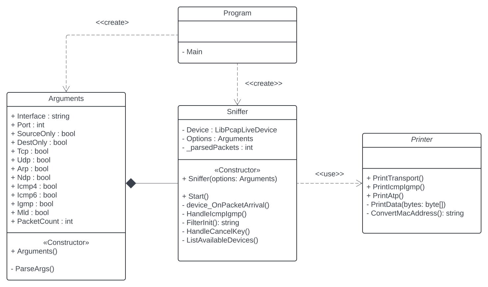

# IPK Project2: Network Sniffer
### Author: Andrii Bondarenko (xbonda06)
<hr>

## Introduction

This project was created as a part of the IPK course at FIT BUT. It entails the implementation of a network sniffer using the
`.NET 8.0` framework. The sniffer is capable of capturing and filtering
`TCP`, `UDP`, `ARP`, `ICMPv4`, `ICMPv6`, `IGMP`, `NDP`, and `MLD` packets and displaying
their contents in a user-friendly format.

<hr>

## Implementation details

The sniffer is implemented using the `SharpPcap` library, which provides
a high-level API for capturing and analyzing network packets.

### Arguments Parsing

In the first step, the program parses the command-line arguments. Class `Program` calls the constructor of the `Arguments` class, which provides CLI arguments parsing and validation. In case of invalid arguments, the program exits with an error message. Then the instance of the `Arguments` class contains all the necessary information for the `Sniffer`.

### Sniffer

After parsing the arguments, the `Program` calls the `Sniffer` constructor with the `Arguments` instance, which initializes the sniffer with the provided arguments. The sniffer encapsulates the functionality for capturing and analyzing network packets.

#### Packet Capture Setup

The `Start` method of the `Sniffer` class initiates the packet capturing process. It subscribes to the `Console.CancelKeyPress` event to handle termination (Ctrl+C) gracefully. The method then opens the network interface in promiscuous mode and applies a packet filter based on the specified criteria, such as protocol type and port numbers.

#### Packet Arrival Handling

The `device_OnPacketArrival` event handler is triggered whenever a packet is captured. It extracts relevant information from the packet, such as timestamp, packet length, and payload data. Depending on the packet's protocol, it invokes corresponding methods to process and print packet details using the `Printer` class.

### Printer

The `Printer` class serves as a helper class for printing packets in a user-friendly format. It provides methods for printing various types of network packets, including TCP, UDP, ARP, ICMP, ICMP6, IGMP, MLD, and NDP packets. These methods take packet information as input parameters and format them for display.

#### Printing Methods

- `PrintTransport`: Prints UDP and TCP headers along with their data payload.
- `PrintIcmpIgmp`: Prints ICMP, ICMP6, IGMP, MLD, and NDP packets along with their data payload.
- `PrintAtp`: Prints ARP packets along with their header and data payload.

Additionally, the `Printer` class contains private helper methods such as `PrintData` and `ConvertMacAddress` for internal use. These methods handle the formatting and conversion of packet data for printing purposes.

### Interaction between Sniffer and Printer

The `Sniffer` class, upon capturing a packet, extracts relevant information and passes it to the appropriate printing method in the `Printer` class based on the packet's protocol type. This interaction ensures that packet details are printed in a clear and organized manner, facilitating effective analysis of network traffic.

<hr>

## Uml Class Diagram
For a better understanding of the project structure, the UML class diagram is provided below:



<hr>

## Usage

### Build

```bash
$ make
```
After building the project, the directory `/build` will be created with the executable `ipk-sniffer` in the root.

### Run

Go to the `/build` directory and run the executable with the following arguments:
```bash
./ipk-sniffer [-i interface | --interface interface] {-p|--port-source|--port-destination port [--tcp|-t] [--udp|-u]} [--arp] [--ndp] [--icmp4] [--icmp6] [--igmp] [--mld] {-n num}
```

`-i eth0` or `--interface` specifies the interface for packet sniffing. If not provided, a list of available interfaces is displayed.

`-p` sets the port number. If not specified, the entire range from 0 to 65535 is considered.

`--port-destination 23` extends port-based filtering to TCP/UDP packets based on destination port number.

`--port-source 23` extends port-based filtering to TCP/UDP packets based on source port number.

`--tcp` includes TCP packets in the filter.

`--udp` includes UDP packets in the filter.

`--arp` includes ARP packets in the filter.

`--icmp4` includes ICMPv4 packets in the filter.

`--icmp6` includes ICMPv6 packets in the filter.

`--igmp` includes IGMP packets in the filter.

`--mld` includes MLD packets in the filter.

`--ndp` includes NDP packets in the filter.

`-n` specifies the number of packets to capture, defaults to 1 if not specified.

### Clean
```bash
$ make clean
```

<hr>

## Testing

OS: Ubuntu 22.04 <br />
Platform: AMD64

### Test 1: Running the sniffer without arguments
- **Description**: Running program without arguments should display a list of available interfaces.
- **Run**:
```sh
./ipk-sniffer
```
- **Expected output**: A list of available interfaces.
- **Result**:
```sh
Available devices:
1. eth0
2. lo
```

<hr>

### Test 2: Running the sniffer with no interface specified
- **Description**: Running the program without specifying an interface should display the list of available interfaces.
- **Run**:
```sh
./ipk-sniffer -i -p 22 --tcp --udp --arp
```
- **Expected output**: The list of available interfaces.
- **Result**:
```sh
Available devices:
1. eth0
2. lo
```

<hr>

### Test 3: Running the sniffer with an invalid interface
- **Description**: Running the program with an invalid interface should display an error message.
- **Run**:
```sh
./ipk-sniffer -i invalid_interface
```
- **Expected output**: Error message indicating an invalid interface.
- **Result**:
```sh
Device invalid_interface not found
```

### Test 4: Running the sniffer with invalid argument
- **Description**: Running the program with an invalid argument should display an error message.
- **Run**:
```sh
./ipk-sniffer -i eth0 -p 22 --tcp --udp --arp --invalid
```
- **Expected output**: Error message indicating an invalid argument.
- **Result**:
```sh
Unknown argument: -k
```

<hr>

### Test 5: Running the sniffer with a valid interface and no more arguments
- **Description**: Running the program with a valid interface and no additional arguments should capture one packet.
- **Run**:
```sh
./ipk-sniffer -i eth0
```
- **Expected output**: The program captures one packet and displays its details.
- **Result**:
```sh
timestamp: 2024-04-22T19:12:30.423+00:00
src IP: 172.22.224.1
dst IP: 239.255.255.250
src port: 53589
dst port: 1900
frame length: 207

0x0000: 01 00 5E 7F FF FA 00 15 5D 39 5B 96 08 00 45 00  ..^.....]9[...E.
0x0010: 00 C1 8D 36 00 00 01 11 AF E3 AC 16 E0 01 EF FF  ...6............
0x0020: FF FA D1 55 07 6C 00 AD E8 E6 4D 2D 53 45 41 52  ...U.l....M-SEAR
0x0030: 43 48 20 2A 20 48 54 54 50 2F 31 2E 31 0D 0A 48  CH * HTTP/1.1..H
0x0040: 4F 53 54 3A 20 32 33 39 2E 32 35 35 2E 32 35 35  OST: 239.255.255
0x0050: 2E 32 35 30 3A 31 39 30 30 0D 0A 4D 41 4E 3A 20  .250:1900..MAN:
0x0060: 22 73 73 64 70 3A 64 69 73 63 6F 76 65 72 22 0D  "ssdp:discover".
0x0070: 0A 4D 58 3A 20 31 0D 0A 53 54 3A 20 75 72 6E 3A  .MX: 1..ST: urn:
0x0080: 64 69 61 6C 2D 6D 75 6C 74 69 73 63 72 65 65 6E  dial-multiscreen
0x0090: 2D 6F 72 67 3A 73 65 72 76 69 63 65 3A 64 69 61  -org:service:dia
0x00A0: 6C 3A 31 0D 0A 55 53 45 52 2D 41 47 45 4E 54 3A  l:1..USER-AGENT:
0x00B0: 20 4F 70 65 72 61 2F 31 32 34 2E 30 2E 36 33 35   Opera/124.0.635
0x00C0: 36 2E 36 20 57 69 6E 64 6F 77 73 0D 0A 0D 0A     6.6 Windows....
```

<hr>

### Test 6: Running the sniffer with a valid interface and port-based tcp filtering
- **Description**: Running the program with a valid interface and port-based filtering should capture packets based on the specified port.\
- **Run**:
```sh
./ipk-sniffer -i eth0 -p 4567 --tcp
```
- **Expected output**: The program captures one packet with the specified port and tcp protocol and displays its details.
- **Result**:
```sh
timestamp: 2024-04-22T19:32:07.664+00:00
src IP: 127.0.0.1
dst IP: 127.0.0.1
src port: 20
dst port: 4567
frame length: 89

0x0000: FF FF FF FF FF FF 00 00 00 00 00 00 08 00 45 00  ..............E.
0x0010: 00 4B 00 01 00 00 40 06 7C AA 7F 00 00 01 7F 00  .K....@.|.......
0x0020: 00 01 00 14 11 D7 00 00 00 00 00 00 00 00 50 02  ..............P.
0x0030: 20 00 84 70 00 00 47 45 54 20 2F 20 48 54 54 50   ..p..GET / HTTP
0x0040: 2F 31 2E 31 0D 0A 48 6F 73 74 3A 20 6C 6F 63 61  /1.1..Host: loca
0x0050: 6C 68 6F 73 74 0D 0A 0D 0A                       lhost....
```

<hr>

### Test 7: Running the sniffer with a valid interface and port-based udp filtering
- **Description**: Running the program with a valid interface and port-based filtering should capture packets based on the specified port.
- **Run**:
```sh
./ipk-sniffer -i eth0 -p 12345 --udp
```
- **Expected output**: The program captures one packet with the specified port and udp protocol and displays its details.
- **Result**:
```sh
timestamp: 2024-04-22T19:34:46.325+00:00
src IP: 127.0.0.1
dst IP: 127.0.0.1
src port: 53
dst port: 12345
frame length: 50

0x0000: FF FF FF FF FF FF 00 00 00 00 00 00 08 00 45 00  ..............E.
0x0010: 00 24 00 01 00 00 40 11 7C C6 7F 00 00 01 7F 00  .$....@.|.......
0x0020: 00 01 00 35 30 39 00 10 A4 DE 54 65 73 74 20 55  ...509....Test U
0x0030: 44 50                                            DP
```

<hr>

### Test 8: Running the sniffer with a valid interface and arp filtering
- **Description**: Running the program with a valid interface and arp filtering should capture arp packets.
- **Run**:
```sh
./ipk-sniffer -i eth0 --arp
```
- **Expected output**: The program captures one arp packet and displays its details.
- **Result**:
```sh
timestamp: 2024-04-22T19:38:41.362+00:00
src MAC: 48:2f:6b:cb:02:c6
dst MAC: 00:00:00:00:00:00
frame length: 60

0x0000: FF FF FF FF FF FF 48 2F 6B CB 02 C6 08 06 00 01  ......H/k.......
0x0010: 08 00 06 04 00 01 48 2F 6B CB 02 C6 00 00 00 00  ......H/k.......
0x0020: 00 00 00 00 00 00 0A BC 04 DE 00 00 00 00 00 00  ................
0x0030: 00 00 00 00 00 00 00 00 00 00 00 00              ............
```

<hr>

### Test 9: Running the sniffer with a valid interface and icmpv4 filtering
- **Description**: Running the program with a valid interface and icmpv4 filtering should capture icmpv4 packets.
- **Run**:
```sh
./ipk-sniffer -i eth0 --icmp4
```
- **Expected output**: The program captures one icmpv4 packet and displays its details.
- **Result**:
```sh
timestamp: 2024-04-22T19:39:59.532+00:00
src MAC: 00:00:00:00:00:00
dst MAC: ff:ff:ff:ff:ff:ff
frame length: 42
src IP: 127.0.0.1
dst IP: 127.0.0.1

0x0000: FF FF FF FF FF FF 00 00 00 00 00 00 08 00 45 00  ..............E.
0x0010: 00 1C 00 01 00 00 40 01 7C DE 7F 00 00 01 7F 00  ......@.|.......
0x0020: 00 01 08 00 F7 FF 00 00 00 00                    ..........
```

<hr>

### Test 10: Running the sniffer with a valid interface and icmpv6 filtering
- **Description**: Running the program with a valid interface and icmpv6 filtering should capture icmpv6 packets.
- **Run**:
```sh
./ipk-sniffer -i eth0 --icmp6
```
- **Expected output**: The program captures one icmpv6 echo packet and displays its details.
- **Result**:
```sh
timestamp: 2024-04-22T19:57:00.609+00:00
src MAC: 00:00:00:00:00:00
dst MAC: ff:ff:ff:ff:ff:ff
frame length: 62
src IP: ::1
dst IP: ::1

0x0000: FF FF FF FF FF FF 00 00 00 00 00 00 86 DD 60 00  ..............`.
0x0010: 00 00 00 08 3A 40 00 00 00 00 00 00 00 00 00 00  ....:@..........
0x0020: 00 00 00 00 00 01 00 00 00 00 00 00 00 00 00 00  ................
0x0030: 00 00 00 00 00 01 80 00 7F BB 00 00 00 00        ..............
```

<hr>

### Test 11: Running the sniffer with a valid interface and igmp filtering
- **Description**: Running the program with a valid interface and igmp filtering should capture igmp packets.
- **Run**:
```sh
./ipk-sniffer -i eth0 --igmp
```
- **Expected output**: The program captures one igmp packet and displays its details.
- **Result**:
```sh
timestamp: 2024-04-22T19:58:53.928+00:00
src MAC: b8:af:67:82:7d:a3
dst MAC: 90:e8:68:51:9d:5f
frame length: 56
src IP: 192.168.1.3
dst IP: 239.255.255.250

0x0000: 90 E8 68 51 9D 5F B8 AF 67 82 7D A3 08 00 46 C0  ..hQ._..g.}...F.
0x0010: 00 20 00 00 00 00 01 02 72 72 C0 A8 01 03 EF FF  . ......rr......
0x0020: FF FA 94 04 00 00 11 0A FE FA EF FF FF FA 00 00  ................
0x0030: 00 00 00 00 00 00 00 00                          ........
```

<hr>

### Test 12: Running the sniffer with a valid interface and mld filtering
- **Description**: Running the program with a valid interface and mld filtering should capture mld packets.
- **Run**:
```sh
./ipk-sniffer -i eth0 --mld
```
- **Expected output**: The program captures one mld packet and displays its details.
- **Result**:
```sh
timestamp: 2024-04-22T20:00:23.631+00:00
src MAC: 90:e8:68:51:9d:5f
dst MAC: 33:33:00:00:00:01
frame length: 78
src IP: fe80::7401:9721:1ae6:3d79
dst IP: ff02::1

0x0000: 33 33 00 00 00 01 90 E8 68 51 9D 5F 86 DD 60 00  33......hQ._..`.
0x0010: 00 00 00 18 3A 01 FE 80 00 00 00 00 00 00 74 01  ....:.........t.
0x0020: 97 21 1A E6 3D 79 FF 02 00 00 00 00 00 00 00 00  .!..=y..........
0x0030: 00 00 00 00 00 01 82 00 F5 95 27 10 00 00 00 00  ..........'.....
0x0040: 00 00 00 00 00 00 00 00 00 00 00 00 00 00        ..............
```

<hr>

### Test 13: Running the sniffer with a valid interface and ndp filtering
- **Description**: Running the program with a valid interface and ndp filtering should capture ndp packets.
- **Run**:
```sh
./ipk-sniffer -i eth0 --ndp
```
- **Expected output**: The program captures one ndp packet and displays its details.
- **Result**:
```sh
timestamp: 2024-04-22T20:01:12.079+00:00
src MAC: 00:00:00:00:00:00
dst MAC: ff:ff:ff:ff:ff:ff
frame length: 78
src IP: ::1
dst IP: ::1

0x0000: FF FF FF FF FF FF 00 00 00 00 00 00 86 DD 60 00  ..............`.
0x0010: 00 00 00 18 3A FF 00 00 00 00 00 00 00 00 00 00  ....:...........
0x0020: 00 00 00 00 00 01 00 00 00 00 00 00 00 00 00 00  ................
0x0030: 00 00 00 00 00 01 87 00 78 AA 00 00 00 00 00 00  ........x.......
0x0040: 00 00 00 00 00 00 00 00 00 00 00 00 00 01        ..............
```

<hr>

### Test 14: Running the sniffer with a valid interface and multiple filters and packet count
- **Description**: Running the program with a valid interface and multiple filters should capture packets based on the specified criteria.
- **Run**:
```sh
./ipk-sniffer -i eth0 -p 12345 --udp --mld --ndp -n 3
```
- **Expected output**: The program captures three packets with the specified port and udp or mld or ndp protocol and displays their details.
- **Result**:
```sh
timestamp: 2024-04-22T20:03:56.357+00:00
src MAC: 00:00:00:00:00:00
dst MAC: ff:ff:ff:ff:ff:ff
frame length: 78
src IP: ::1
dst IP: ::1

0x0000: FF FF FF FF FF FF 00 00 00 00 00 00 86 DD 60 00  ..............`.
0x0010: 00 00 00 18 3A FF 00 00 00 00 00 00 00 00 00 00  ....:...........
0x0020: 00 00 00 00 00 01 00 00 00 00 00 00 00 00 00 00  ................
0x0030: 00 00 00 00 00 01 87 00 78 AA 00 00 00 00 00 00  ........x.......
0x0040: 00 00 00 00 00 00 00 00 00 00 00 00 00 01        ..............

timestamp: 2024-04-22T20:03:59.134+00:00
src MAC: 90:e8:68:51:9d:5f
dst MAC: 33:33:00:00:00:01
frame length: 78
src IP: fe80::7401:9721:1ae6:3d79
dst IP: ff02::1

0x0000: 33 33 00 00 00 01 90 E8 68 51 9D 5F 86 DD 60 00  33......hQ._..`.
0x0010: 00 00 00 18 3A 01 FE 80 00 00 00 00 00 00 74 01  ....:.........t.
0x0020: 97 21 1A E6 3D 79 FF 02 00 00 00 00 00 00 00 00  .!..=y..........
0x0030: 00 00 00 00 00 01 82 00 F5 95 27 10 00 00 00 00  ..........'.....
0x0040: 00 00 00 00 00 00 00 00 00 00 00 00 00 00        ..............

timestamp: 2024-04-22T20:04:04.957+00:00
src IP: 127.0.0.1
dst IP: 127.0.0.1
src port: 53
dst port: 12345
frame length: 50

0x0000: FF FF FF FF FF FF 00 00 00 00 00 00 08 00 45 00  ..............E.
0x0010: 00 24 00 01 00 00 40 11 7C C6 7F 00 00 01 7F 00  .$....@.|.......
0x0020: 00 01 00 35 30 39 00 10 A4 DE 54 65 73 74 20 55  ...509....Test U
0x0030: 44 50                                            DP
```

<hr>

### Test 15 (Negative): Running the sniffer with an invalid port number
- **Description**: Running the program with an invalid port number should display an error message.
- **Run**:
```sh
./ipk-sniffer -i eth0 -p 65536 --udp
```
- **Expected output**: Error message indicating an invalid port number.
- **Result**:
```sh
Port must be between 0 and 65535
```

<hr>

## Sources

Vladimír Veselý, Project 2 - ZETA: Network sniffer [online]. Publisher: Brno University of Technology, Faculty of Information Technology, April 1th 2024. [cit. 2024-04-01]. Available at: [https://git.fit.vutbr.cz/NESFIT/IPK-Projects-2024/src/branch/master/Project%202/zeta/README.md](https://git.fit.vutbr.cz/NESFIT/IPK-Projects-2024/src/branch/master/Project%202/zeta/README.md)


